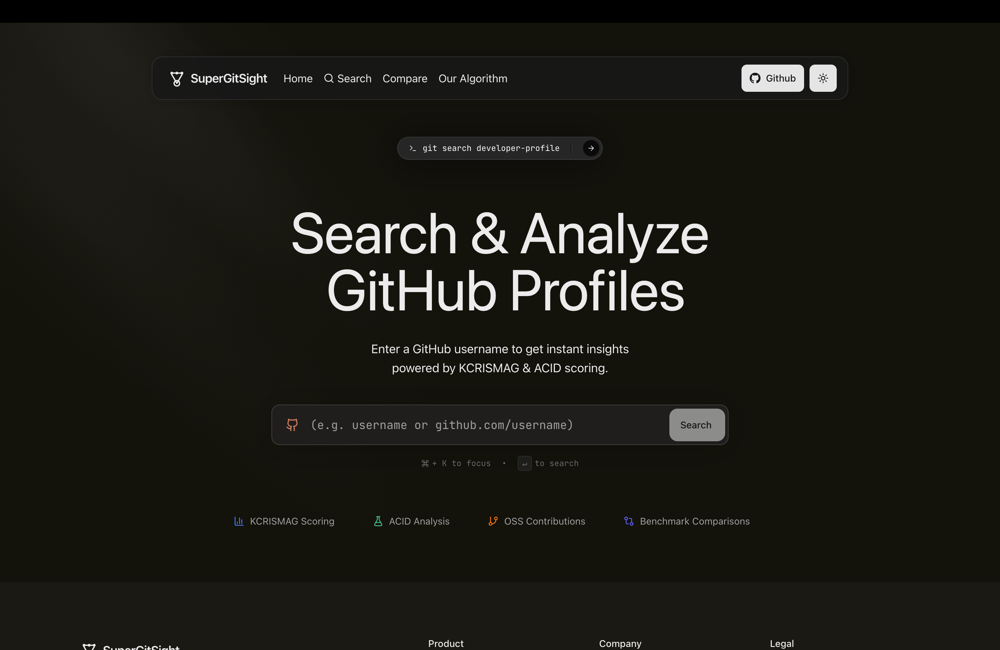
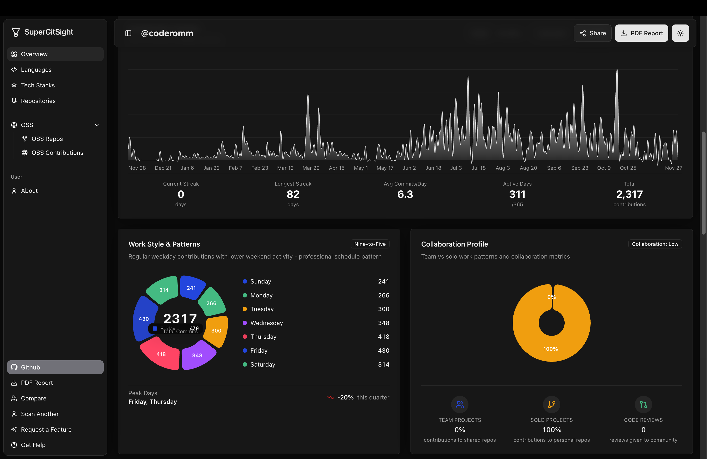
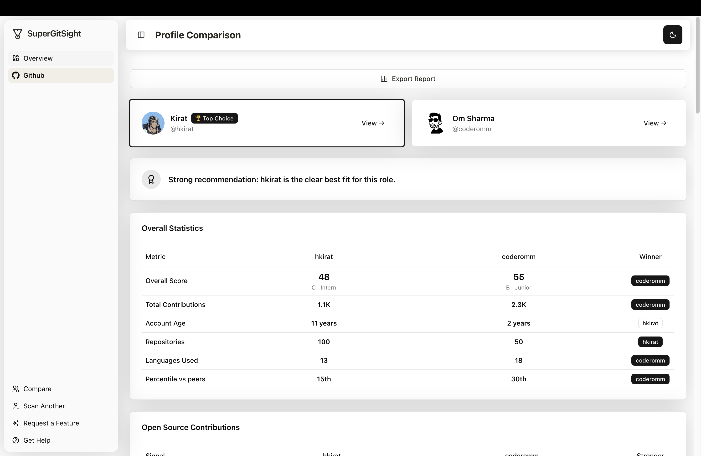
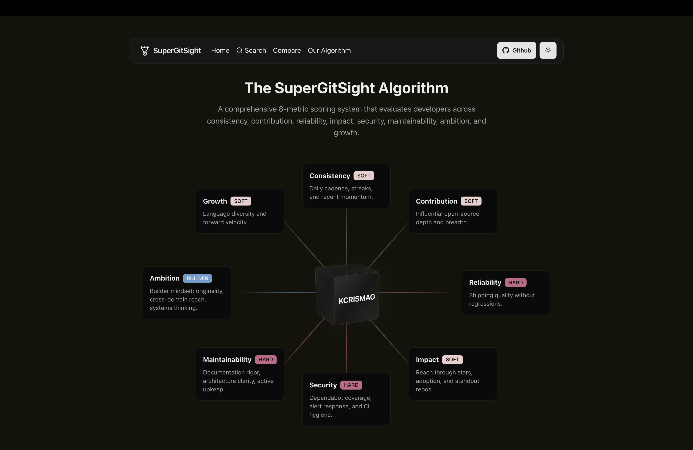
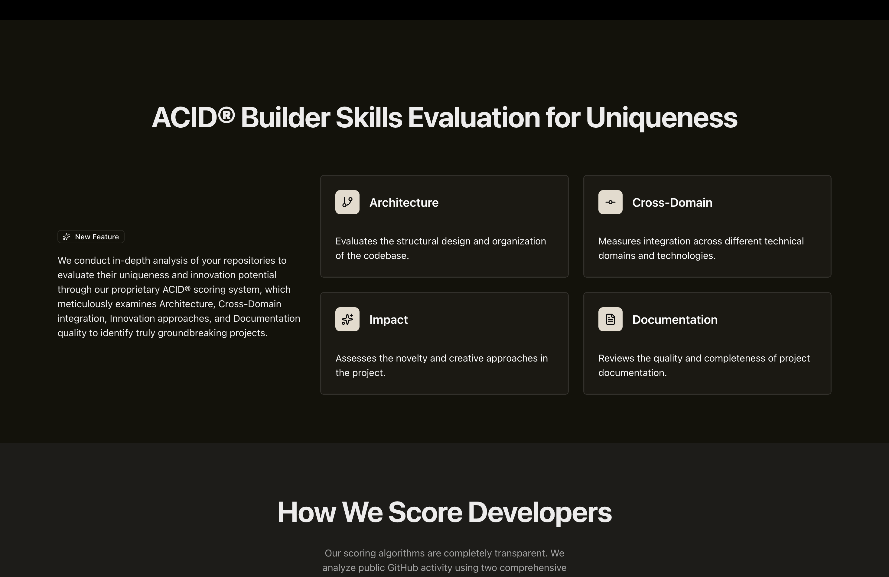
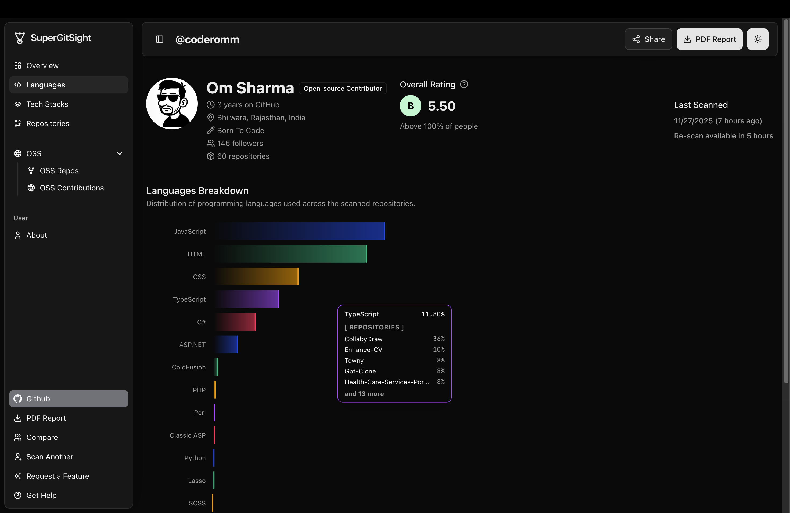

# 🚀 **SuperGitSight — Data-Driven Intelligence for GitHub Profiles**

<p align="center">
  
</p>

<h1 align="center">SuperGitSight</h1>

<p align="center"><strong>Data-driven intelligence for GitHub profiles.</strong></p>

<p align="center">
  <a href="https://supergitsight.xyz">🌐 Live Demo</a> • 
  <a href="#-features">✨ Features</a> • 
  <a href="#-algorithm-overview-minimal">📊 Algorithm</a> • 
  <a href="#-tech-stack">🧩 Tech Stack</a> • 
  <a href="#-future-goals">🔮 Future</a> • 
  <a href="#-contributing">🤝 Contribute</a>
</p>

<p align="center">
  
  
  
  
  
</p>

---

## 📌 Overview

SuperGitSight provides a **deep, structured analysis of GitHub profiles** using multiple dimensions of contribution quality, consistency, and technical traits.  
It transforms raw GitHub data into **clean insights**, helping users understand strengths, patterns, and signals behind any developer's activity.

Whether you're exploring a profile, evaluating contributors, or tracking your own growth — SuperGitSight brings clarity to the GitHub graph.

---

## ✨ Features

- 🔍 **Comprehensive Profile Insight**  
  High-level and granular views of any GitHub user with detailed analytics across contributions, collaboration style, tech stack detection, OSS involvement, and work patterns.

- 📊 **KCRISMAG Profile Scoring**  
  A multi-dimension scoring system evaluating **Consistency**, **Contribution Quality**, **Reliability**, **Impact**, **Security Signals**, **Maintainability Indicators**, **Ambition**, and **Growth**.

- 🧩 **ACID Repository Scoring**  
  Per-repository evaluation across **Architecture Signals**, **Cross-Domain**, **Innovation**, and **Documentation**.

- ⚔️ **Side-by-Side Comparisons**  
  Compare two Github Profiles(devs) with contextual insights, rankings, and recommendations for hiring or team placement.

- 📅 **Contribution & Activity Patterns**  
  Trend analysis across months, weekdays, peak days, and long-term momentum with visual dashboards.

- 🧪 **Tech Stack Detection**  
  Automated language & framework extraction from repo metadata and file structures.

- 📈 **Visual Dashboards**  
  Clean UI to explore insights without noise, including contribution timelines, collaboration breakdowns, and benchmark charts.

- ⚡ **Fast, Zero-Config Usage**  
  Just enter a GitHub username — insights appear within seconds.

- 📄 **Shareable Reports**  
  Export insights as PDF-style reports for profile and comparison results.

---

## 🖼️ Screenshots

<p align="center">
  
  <br />
  <em>Interactive search interface</em>
</p>

<p align="center">
  
  <br />
  <em>Comprehensive profile analysis dashboard</em>
</p>

<p align="center">
  
  <br />
  <em>Side-by-side dev comparison</em>
</p>

<p align="center">
  
  <br />
  <em>KCRISMAG scoring framework breakdown</em>
</p>

<p align="center">
  
  <br />
  <em>ACID repository scoring overview</em>
</p>

<p align="center">
  
  <br />
  <em>Tech stack and language analysis</em>
</p>

---

## 📊 Algorithm Overview (Minimal)

SuperGitSight uses two internal scoring systems:

### **KCRISMAG Profile Scoring**  
A multi-factor profile evaluation across:  
**Consistency**, **Contribution Quality**, **Reliability**, **Impact**, **Security Signals**, **Maintainability Indicators**, **Ambition**, and **Growth**.

### **ACID Repository Scoring**  
Each repository receives an ACID score representing:  
**Architecture Signals**, **Cross-Domain**, **Innovation**, and **Documentation**.

> Only high-level explanations are public.  
> Core scoring logic remains proprietary.  
> Currently, algorithms are in Beta stage.

For detailed information, see our [Scoring Documentation](docs/scoring.md).

---

## 🧩 Tech Stack

- **Framework:** Next.js 16  
- **Language:** TypeScript  
- **UI:** React 19, Tailwind CSS, Shadcn/UI, Framer Motion  
- **Backend:** Server Actions, GitHub GraphQL API  
- **Database:** Prisma ORM + PostgreSQL  
- **Caching:** Redis  

---

## 🌐 Live Demo

👉 **https://supergitsight.xyz**  
Try your GitHub username — insights load instantly.

---

## 🔮 Future Goals

- 🤖 **AI-assisted insight recommendations**  
  Personalized interpretation of GitHub patterns.

- 🔑 **GitHub Token Integration**  
  Enabling deeper insights including private repositories for authenticated users.

- 📊 **Enhanced Analytics**  
  More granular breakdowns and trend predictions.

- 🔔 **Notifications & Alerts**  
  Track profile changes and get notified about significant updates.

More ideas coming soon — follow the repo to stay updated. See our [Roadmap](roadmap/roadmap.md) for detailed plans.

---

## 📦 Installation (Optional)

This repository contains documentation and examples only. The core analysis engine is proprietary and runs on our secure infrastructure.

To explore the documentation:

```bash
git clone https://github.com/supergitsight/supergitsight.git
cd supergitsight
```

### Documentation Structure

- `docs/` - Comprehensive documentation
- `examples/` - Sample JSON outputs
- `roadmap/` - Feature roadmap
- `.github/` - Issue templates and workflows

---

## 📚 Documentation

- [Overview](docs/overview.md) - Learn about SuperGitSight
- [Scoring Algorithms](docs/scoring.md) - Understand KCRISMAG & ACID
- [Features](docs/features.md) - Detailed feature breakdown
- [Architecture](docs/architecture.md) - System architecture overview
- [FAQ](docs/faq.md) - Frequently asked questions
- [Changelog](docs/changelog.md) - Version history

---

## 📊 Example Outputs

Check out our [examples](examples/) folder for sample JSON outputs:

- [Sample Profile Output](examples/sample-profile-output.json)
- [ACID Repository Score](examples/acid-sample.json)
- [KCRISMAG Profile Score](examples/kcrismag-sample.json)

---

## 🤝 Contributing

Contributions, discussions, and feedback are welcome!

1. [Report an issue](https://github.com/supergitsight/supergitsight/issues/new/choose)
2. Fork the repo and create a feature branch
3. Make changes following the existing documentation style
4. Open a pull request with a clear description

See our [Contributing Guide](CONTRIBUTING.md) for details.

---

## 📄 License

MIT License.  
Feel free to use the UI, ideas, and structure — core scoring logic remains proprietary.

Copyright (c) 2025 Om Sharma

---

## 📫 Contact

* 🌐 Website: [https://supergitsight.xyz](https://supergitsight.xyz)
* 🐦 Twitter: [https://twitter.com/supergitsight](https://twitter.com/supergitsight)
* 💬 Discord: [Join Community](https://discord.gg/RdMYBFzQQn)
* 📧 Email: [supergitsight@gmail.com](mailto:supergitsight@gmail.com)
* 🐦 Founder Twitter: [https://twitter.com/1omsharma](https://twitter.com/1omsharma)

---

<div align="center">

Made with ❤️ by the SuperGitSight team

[⭐ Star us on GitHub](https://github.com/supergitsight/supergitsight) • [🐛 Report a bug](https://github.com/supergitsight/supergitsight/issues/new?template=bug_report.md) • [💡 Request a feature](https://github.com/supergitsight/supergitsight/issues/new?template=feature_request.md)

</div>
